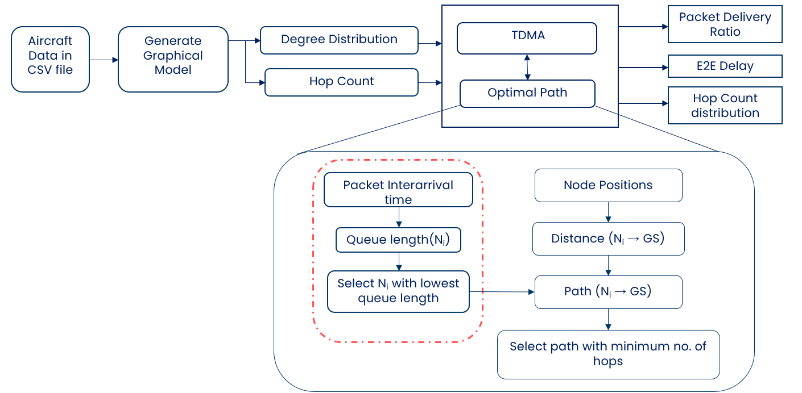

# E2E-Performance-of-Dijkstra-in-AANET

Since the beginning of civil aviation, communications have always relied on direct-link communication. As airline traffic is expected to continue to grow continuously in the coming years, this would lead to saturation of the capacity of current communication systems. Moreover, connection establishment and maintenance in remote areas like oceanic and polar region is considerably challenging due to lack of infrastructure. This research particularly focuses on the oceanic airspace due to its limited capability and discusses its importance in current air traffic growth. Over the recent years, Aeronautical Ad-Hoc Networks (AANETs) have been emerged as an alternative communication infrastructure for aviation which can provide real-time connectivity specially in oceanic and remote areas for aircraft and ground-based systems. 
This research conducts an in-depth analysis of end-to-end performance of Shortest Path Routing in the context of Aeronautical Ad-Hoc Networks.

# Project Workflow



# Project Description
DSPR stands for Dijkstra Shortest Path Routing
This project calculates the shortest path between MANET nodes based on the position using Dijkstra Shortest path Routing Algorithm. This project consists of two main modules:

1. NodeManager
2. DSPR

NodeManager module is responsible for registering nodes and create a graph network based on the position of the nodes at specific timestamps. Based on the graph network, it calculates the shortest path between a source and destination using Dijkstra routing.

DSPR module resembles each MANET node functionality inside the network. At the start of simulation, each nodes will resgister itself with the NodeManager module and specifies its position and address. Nodes will be created through Scenario Manager module.

```
node = getContainingNode(this);
nodeManager->registerClient(node);
```


The NodeManager will then build the network based on the communication range between nodes and find all possible shortest path between the node pairs inside the network.

```
BuildGraph(std::vector<Coord>& position, double communicationRange);
findAllShortestPaths(std::vector<std::vector<int>>& adjacencyMatrix, std::vector<L3Address>& ipAddresses);
```


For shortest path, it will use priority queue based Dijkstra approach and then store the results in a routing table which will be used later by the DSPR module to route packet to the next hop node.

```
using Pair = std::pair<int, int>; // Pair(distance, vertex)
        std::priority_queue<Pair, std::vector<Pair>, std::greater<Pair>> Q;

        Q.push({ 0, src });

        while (!Q.empty()) {
            int u = Q.top().second;
            Q.pop();

            if (visited[u]) continue;
            visited[u] = true;

            for (int v = 0; v < numNodes; v++) {
                if (adjacencyMatrix[u][v] && !visited[v]) {
                    int alt = dist[u] + adjacencyMatrix[u][v];
                    if (alt < dist[v]) {
                        dist[v] = alt;
                        previous[v] = u;
                        Q.push({ dist[v], v });
                    }
                }
            }
        }
```

As the nodes are mobile, the NodeManager module will keep updating at specific timestamps in order to keep the netwowk updated according the current node position and update the routing table with the updated paths.


The study commences with a comprehensive review of the evolving landscape of aeronauticalcommunication systems, including their challenges and limitations. The research particularly aligns into the shortcomings of the current infrastructure and explores potential solutions through the introduction of the emerging communication standard known as LDACS. A substantial portion of the analysis focuses on Mobile Ad-Hoc Network (MANET) routing protocols and their applicability to the development of LDACS. Performance evaluations of various routing protocols are conducted in various network scenarios, drawing from global research efforts to identify existing gaps in network performance evaluation.

The findings of this analysis sheds light on the maximum performance capability of a network model that can be achieved and also serve the crucial role in analyzing the exisitng protocol performance under all MANET environment. The insights gained will contribute to the ongoing development and enhancement of routing protocols for not only aeronautical ad hoc networks, but also all protocols developed under the MANET scenario, thereby strengthening the backbone of modern aviation communication systems.

## Simulation Setup

The simulation scenario will serve as the foundational framework upon which we will conduct our analysis and evaluation. Two simulation scenario to assess the performance of our routing protocols. In the first scenario, we will analyze the adaptability of the routing protocols under different traffic conditions while in the second scenario, we will analyze the reliability of the routing protocols under various network connectivity. Each simulation will process in an iterative manner of 10 runs and the measurement data have been captured in their respective CSV files for post analysis on each run. The KPI's which will has been used are listed below:

| Parameter  | Value |
| ------------- | ------------- |
| Protocols used  | DSPR, GPSR |
| Aircraft No.  | 371 |
| Simulation Time  | 1800s |
| Mobility Model  | BonnMotion Mobility |
| MAC Protocol  | TDMA |
| Radio Propagation Model  | Unit Disk Radio |

The simulation files are located in the ***\OMNET Files*** folder.
The evaluation and result files located in the ***\Python Files*** folder. Under the *\Python Files* folder, two subfolders are present for each simulation scenario.
